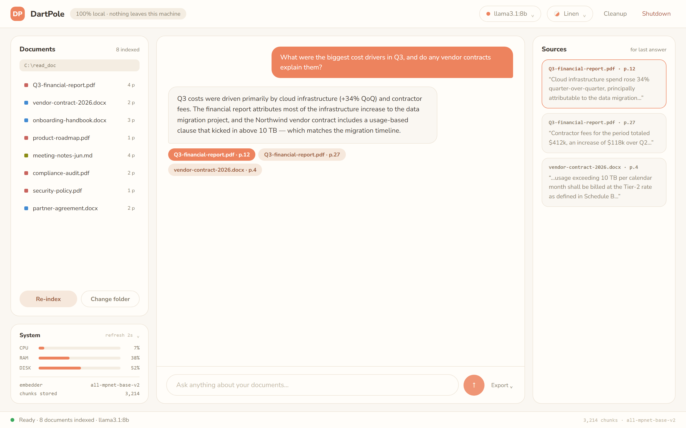
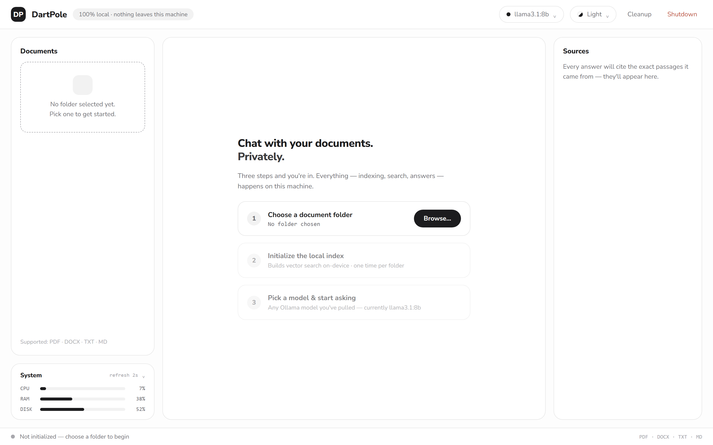
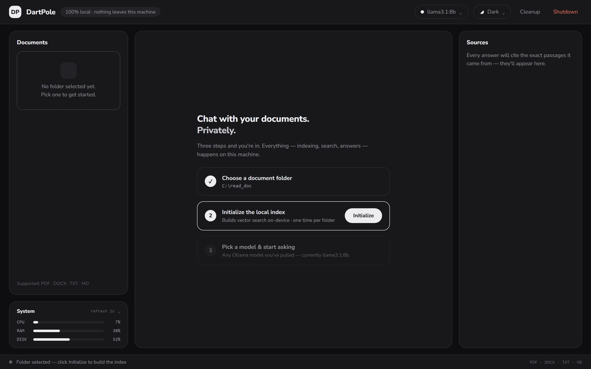
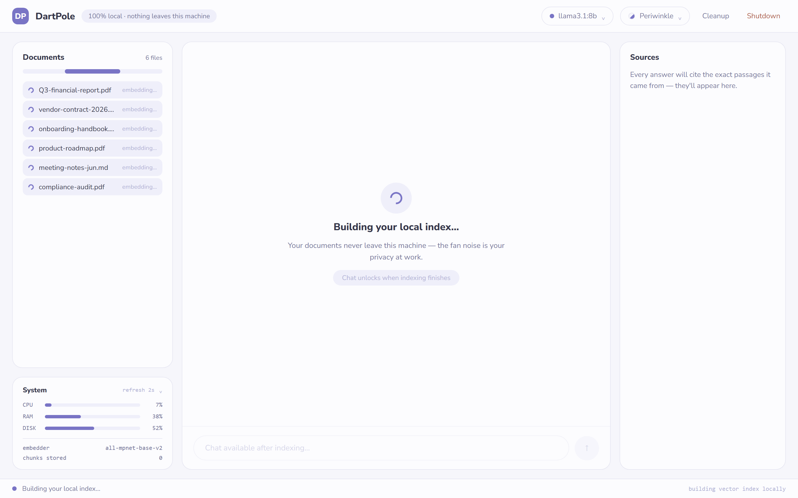
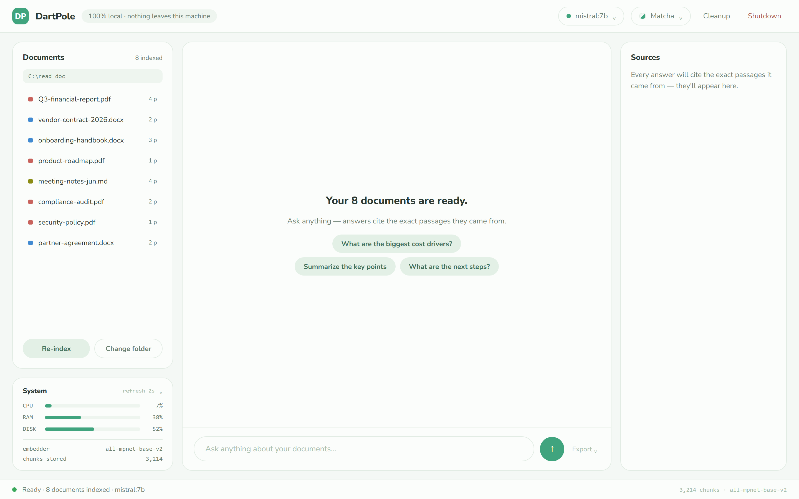
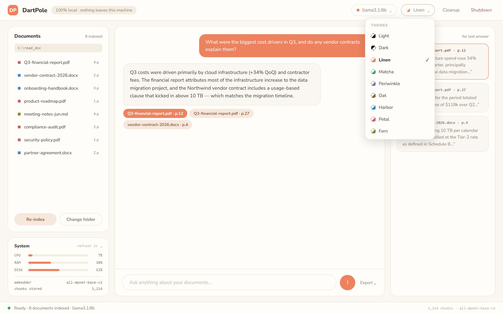

# DartPole

**DartPole** is a fully local RAG (Retrieval-Augmented Generation) desktop app. Point it at a folder of documents, build a vector index on your own machine, pick an Ollama model, and chat with your documents — with every answer citing the exact passages it came from. **Nothing leaves the machine**: indexing, vector search, and LLM inference all run locally.



---

## Highlights

- **100% local** — documents, embeddings, vector store, and the LLM all stay on-device. (One-time exception: the first run downloads the embedding model from Hugging Face, and Ollama models are downloaded when you `ollama pull` them. After that, everything runs offline.)
- **Guided first run** — a three-step flow (choose folder → initialize index → pick a model) gets you chatting in seconds.
- **Grounded answers** — responses cite the exact source passages; a **Sources** panel shows the quoted text per citation.
- **9 built-in themes** — Light, Dark, Linen, Matcha, Periwinkle, Oat, Harbor, Petal, Fern (choice persists across sessions).
- **Live system stats** — collapsible CPU / RAM / DISK panel that polls every 2 s; CPU bar turns red under heavy load.
- **Any Ollama model** — the header model picker lists every model you've pulled (name + size).

---

## The three stages

DartPole is a single screen with a persistent shell (header · left column · center · Sources panel · status footer). The center and Documents panels change with the stage: **fresh → indexing → ready**.

### 1. Fresh — not initialized
Guided 3-step start. Browse for a folder, then **Initialize** the local index.

| Light | Dark (folder chosen) |
|---|---|
|  |  |

### 2. Indexing
Documents are embedded on-device. The Documents panel lists the files being processed; the System panel auto-shows the embedder and live chunk count.



### 3. Ready — chat
The Documents panel shows the indexed files (with file-type dots and page counts). Ask anything; suggestion chips help you start.



### Themes
All nine themes are available from the header theme picker. Each pairs a tinted surface set with one accent.



---

## Architecture

```
main.py            UI + API dispatcher (Werkzeug), serves the static frontend
mcp_server.py      Flask API: /initialize, /models, /select_model, /query,
                   /documents, /status, /browse-folder, /list-folder,
                   /stats/{cpu,ram,disk}, /cleanup, /shutdown
llm_manager.py     Embeddings (HuggingFace), Chroma vector store, Ollama RAG chain
config.py          All tunables (APP_NAME, models, chunking, ports, prompt)
document_processing/   PDF / DOCX / TXT / MD extraction, OCR, chunking
index.html         Single-screen shell (3 stages)
css/style.css      12-token theme system + full layout
js/main.js         Stage machine, theme + model pickers, stats, chat/citations
```

### Frontend design tokens
Twelve CSS custom properties drive every color; theming = swapping the set (applied on `:root` by JS, persisted under the `ida-theme` key):

`--bg` `--sf` `--s2` `--bd` (surfaces/border) · `--tx` `--tm` `--tf` (text) · `--ac` `--as` `--at` `--oa` (accent family) · `--dg` (danger).

File-type dots are theme-independent: PDF `oklch(0.62 0.13 25)`, DOCX `oklch(0.62 0.13 250)`, MD/TXT `oklch(0.62 0.13 110)`.

---

## Running

### Prerequisites
- **Python 3.12+**
- **[Ollama](https://ollama.com)** installed and on `PATH`, with at least one model pulled (e.g. `ollama pull llama3.1:8b`).
- Optional (better PDF handling): **Tesseract OCR** and **Poppler** — see `requirements.txt` for links.

### Install & start
```bash
pip install -r requirements.txt
python main.py
```
The UI opens automatically at **http://localhost:8000** (API under `/api`). Options: `--docs <path>`, `--port <n>`, `--no-browser`, `--log-level DEBUG`.

### Use
1. **Browse…** to a documents folder (PDF · DOCX · TXT · MD).
2. **Initialize** — DartPole builds the on-device vector index.
3. Pick a pulled **Ollama model** from the header, then ask away. Answers cite their sources; click a citation chip or a Sources card to focus it. **Export** downloads the conversation.

Header actions: **Cleanup** resets the session and clears the vector store; **Shutdown** terminates the server. The vector store is session-only — cleared on startup and shutdown, so document data never accumulates on disk.

---

## Notes on the redesign implementation

- The frontend is a faithful build of the `InsightDocsAI App.dc.html` reference prototype (the designated primary deliverable), rebranded to **DartPole** and wired to the existing Flask backend.
- Because indexing is a single blocking backend call (no per-file streaming API), the indexing stage uses an indeterminate progress bar plus the real file list from `/list-folder`, rather than fabricated per-file completion events.
- Citation quotes are real: `/query` now returns each retrieved passage's text alongside its metadata so the Sources panel can show the exact quote.

---

## License

[MIT](LICENSE) © 2026 Sahil Malik
